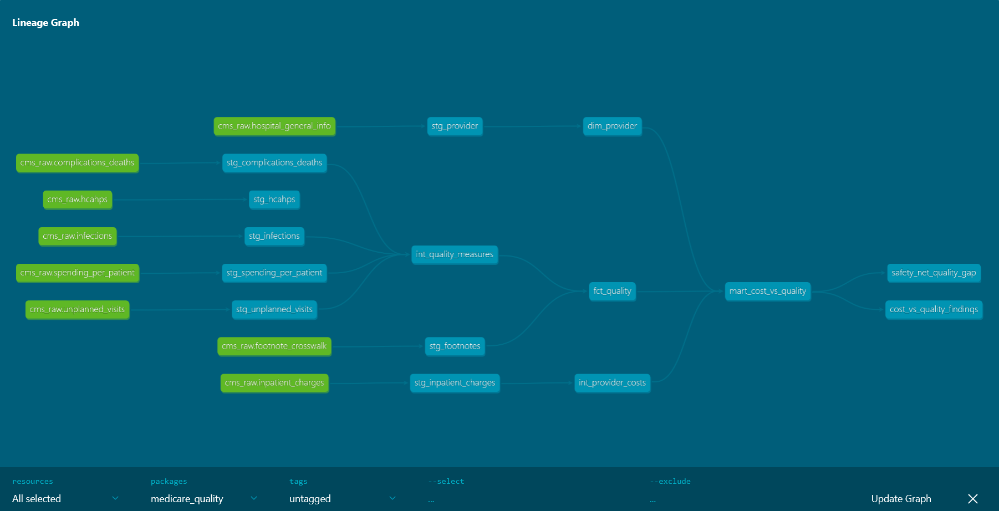

# Medicare Quality Warehouse


A dbt warehouse on Snowflake joining what hospitals **charge** to how well they
**perform**, across 5,658 facilities and four annual CMS snapshots.

**The question:** do hospitals that charge more deliver better outcomes?

---

## What I found

### Charges rise 5.2×. Clinical quality improves modestly. Patient experience gets worse.

| Charge quartile | Hospitals | Avg charge | CMS stars | Patient exp. stars | Readmission | Mortality | Spending ratio |
|---|---:|---:|---:|---:|---:|---:|---:|
| 1 (lowest) | 721 | $27,024 | 3.04 | 3.42 | 16.36 | 13.29 | 0.963 |
| 2 | 721 | $47,763 | 3.08 | 3.20 | 15.41 | 12.29 | 0.981 |
| 3 | 721 | $72,278 | 3.05 | 2.98 | 14.97 | 11.74 | 1.003 |
| 4 (highest) | 720 | $141,584 | **2.95** | **2.80** | 14.62 | 11.20 | 1.019 |

Going from the cheapest quartile to the most expensive:

- **Charges rise 424%**
- Mortality falls 15.7%, readmissions fall 10.6% — real improvements, but nowhere
  near proportional
- Patient experience stars fall 18.1%
- **Medicare's actual spending rises just 5.8%** (0.963 → 1.019)

That last line is the one worth sitting with. Hospitals billing 5.2× more cost
Medicare about 6% more per beneficiary. Chargemaster rates and what Medicare
actually pays are almost unrelated quantities.

### The patient experience decline is about communication, not facilities

The CMS composite star rating dips in the top quartile even though mortality and
readmission both improve. Breaking the patient experience measures apart shows
where it comes from:

| Measure | Q1 (lowest charge) | Q4 (highest charge) | Gap |
|---|---:|---:|---:|
| Nurse communication | 3.68 | 2.82 | **−0.86** |
| Doctor communication | 3.38 | 2.61 | **−0.77** |
| Quietness | 3.38 | 2.65 | −0.72 |
| Discharge information | 3.54 | 2.91 | −0.63 |
| Communication about medicines | 2.79 | 2.18 | −0.61 |
| Cleanliness | 3.40 | 3.03 | −0.37 |
| Overall hospital rating | 3.41 | 3.04 | −0.37 |
| Would recommend | 3.52 | 3.27 | **−0.25** |

Four of the five widest gaps are communication measures. Cleanliness — the
obvious "old building" explanation — is among the *smallest* gaps.

And the two global assessments move least. The share of patients who would
definitely recommend their hospital is essentially flat across all four
quartiles (67.8%, 68.5%, 68.2%, 68.4%). Patients at expensive hospitals rate
specific communication interactions much worse while their overall verdict
stays intact.

A plausible reading: high-charge hospitals skew toward large academic centers
where patients see rotating teams, residents, and multiple specialists, so
communication fragments — while patients understand they are receiving complex
care. This is consistent across nine independent measures but remains an
interpretation, not a demonstrated mechanism.

### Safety-net hospitals score lower at every charge level

| Safety net | Q1 | Q2 | Q3 | Q4 |
|---|---:|---:|---:|---:|
| No | 3.08 | 3.13 | 3.10 | 2.96 |
| Yes | 2.90 | 2.66 | 2.63 | 2.89 |

Public, government, and tribal facilities rate below their peers in every charge
quartile, and cluster heavily in the lowest quartile (168 hospitals, versus
roughly 73 in each higher quartile). Whether CMS star ratings penalize hospitals
serving sicker and poorer populations is an active policy argument; this is one
more data point in it.

### Caveats

- Cross-sectional and correlational. No causal claim is made or supported.
- Case-mix differences persist despite CMS risk adjustment. High-charge hospitals
  skew academic and treat more complex patients.
- Chargemaster rates are widely understood to be disconnected from negotiated
  prices. That disconnect is arguably the finding rather than a limitation.
- Quality measures are suppressed below minimum case counts, so the dataset
  carries a volume floor.

---

## Data

Two CMS sources, joined on the CMS Certification Number (CCN).

| Source | Grain | Scope |
|---|---|---|
| Hospital Care Compare | Provider × measure × vintage | 5,658 facilities, 4 snapshots (Jan 2023 – Feb 2026) |
| Inpatient Hospitals by Provider and Service | Provider × MS-DRG × year | 438,048 records, 2,906 hospitals, 2022–2024 |

**Join coverage:** 2,883 of 2,906 inpatient providers match Care Compare
(**99.2%**). The 23 that do not are almost certainly closures between vintages.
Care Compare covers 2,543 additional facilities — critical access, psychiatric,
and children's hospitals that do not bill through IPPS — so the cost-vs-quality
mart is an inner join over the overlap.

Sources: [Care Compare archive](https://data.cms.gov/provider-data/archived-data/hospitals) ·
[Inpatient PUF](https://data.cms.gov/provider-summary-by-type-of-service/medicare-inpatient-hospitals/medicare-inpatient-hospitals-by-provider-and-service)

---

## Architecture



```
RAW (Snowflake)          8 source tables, loaded as-is with a vintage column
  └── staging            8 views: typed, renamed, CCN normalized
       └── intermediate  2 views: measures unioned, costs aggregated
            └── marts    3 tables: dim_provider, fct_quality, mart_cost_vs_quality
                 └── analyses  3 compiled queries producing the findings above
```

**Stack:** dbt Core · Snowflake · SQL · Jinja · Git · GitHub Actions · Python (profiling, loading)

**33 data tests** across the three layers — uniqueness, referential integrity,
accepted values, accepted ranges, and composite key constraints. CI runs
`dbt build` against Snowflake on every push.

---

## What the tests caught

The tests are not decoration. Each of these was found by a failing test, not by
reading the data.

**Three footnote definitions changed between snapshots.** A uniqueness test on
`footnote_code` failed with three duplicates. Two were rewordings (HCAHPS →
CAHPS, "hospital" → "facility"), but code 22 changed *scope*: it covered only
Department of Defense hospitals in earlier releases and was widened to include
Veterans Health Administration hospitals later. Keying the lookup on code alone
would have applied the wrong definition to older data. The dimension is now
keyed on code **and** vintage.

**CMS renamed three columns mid-series.** `CITY` → `CITY_TOWN`, `COUNTY_NAME` →
`COUNTY_PARISH`, `PHONE_NUMBER` → `TELEPHONE_NUMBER`. Stacking the vintages
produced both sets of columns, each populated only for the years using that
name. Resolved with `COALESCE` in staging rather than dropping either.

**39 provider-years pay more than they bill.** An accepted-range test on
`payment_to_charge_ratio` flagged ratios above 1.0. Investigating showed they
concentrate almost entirely in public and tribal facilities — Provident Hospital
of Chicago, John H Stroger Jr, Harris Health, Claremore Indian Hospital, Tuba
City Regional. These carry low chargemaster rates while receiving supplemental
payments, so a ratio above 1.0 is expected rather than erroneous. The test was
changed to `severity: warn` so the count stays visible without failing builds,
and the finding drove the `is_safety_net` flag in the provider dimension.

**HCAHPS shrank across vintages.** Roughly 93 measures per provider in 2023 down
to 68 by 2026 as CMS retired items. Preserved rather than filtered so the drift
stays visible downstream.

**27,844 orphaned quality rows.** A relationships test between `fct_quality` and
`dim_provider` warns on measures belonging to providers that exited before the
latest vintage. Expected given 559 providers entered or exited across the four
snapshots — set to warn rather than error.

---

## Engineering notes

**CCNs are normalized everywhere.** A `clean_ccn` macro zero-pads to six
characters. Any step treating a CCN as a number strips leading zeros and
silently breaks joins — this is what produces the 99.2% match rate rather than
something far lower.

**Scores use `TRY_CAST`, never `CAST`.** CMS writes "Not Available" and "Not
Applicable" into the same column as real values. `TRY_CAST` converts what it can
and returns NULL for the rest, so suppression stays visible as NULL instead of
failing the build or silently becoming zero.

**Cost aggregation is discharge-weighted.** The `Avg_*` columns in the inpatient
file are already averages across each hospital's discharges for that DRG.
Averaging them directly treats a hospital with 8 discharges the same as one with
2,400. Every cost figure here computes `SUM(discharges × avg) / SUM(discharges)`.
Measured in the companion project, unweighted averaging distorts results by up
to 44% in some DRGs.

**The four measure files union rather than join.** They share a common core and
differ only in extras, so staging casts the missing columns as NULL and gives
every model one shape. HCAHPS is deliberately excluded from that union — it
carries four independent footnote columns and a different value structure, so
forcing it in would lose information.

---

## Repository

```
├── .github/workflows/     CI: dbt build on every push
├── docs/
│   ├── quality_profile.md Data profile across all four vintages
│   └── img/
├── medicare_quality/      dbt project
│   ├── models/
│   │   ├── staging/       8 models
│   │   ├── intermediate/  2 models
│   │   └── marts/         3 models
│   ├── analyses/          3 queries producing the findings above
│   ├── macros/            clean_ccn, generate_schema_name
│   └── profiles.yml       CI target, env vars only
├── profile_quality_data.py
├── load_to_snowflake.py
└── load_inpatient.py
```

---

## Reproducing

1. Download 3–4 vintages from the [Care Compare archive](https://data.cms.gov/provider-data/archived-data/hospitals)
   into `data/selected/<vintage>/`, keeping the seven files referenced in
   `load_to_snowflake.py`
2. `python profile_quality_data.py` — regenerates the profile and CCN join check
3. `python load_to_snowflake.py` and `python load_inpatient.py` — load to `RAW`
4. `cd medicare_quality && dbt deps && dbt build`

Requires a Snowflake account with a `MEDICARE_QUALITY` database and `RAW`,
`STAGING`, `INTERMEDIATE`, `MARTS`, and `CI` schemas.

---

## Related

The inpatient charge data comes from a companion Power BI project analyzing
provider cost and utilization:
[medicare-provider-cost-dashboard](https://github.com/nirmit013/medicare-provider-cost-dashboard)
